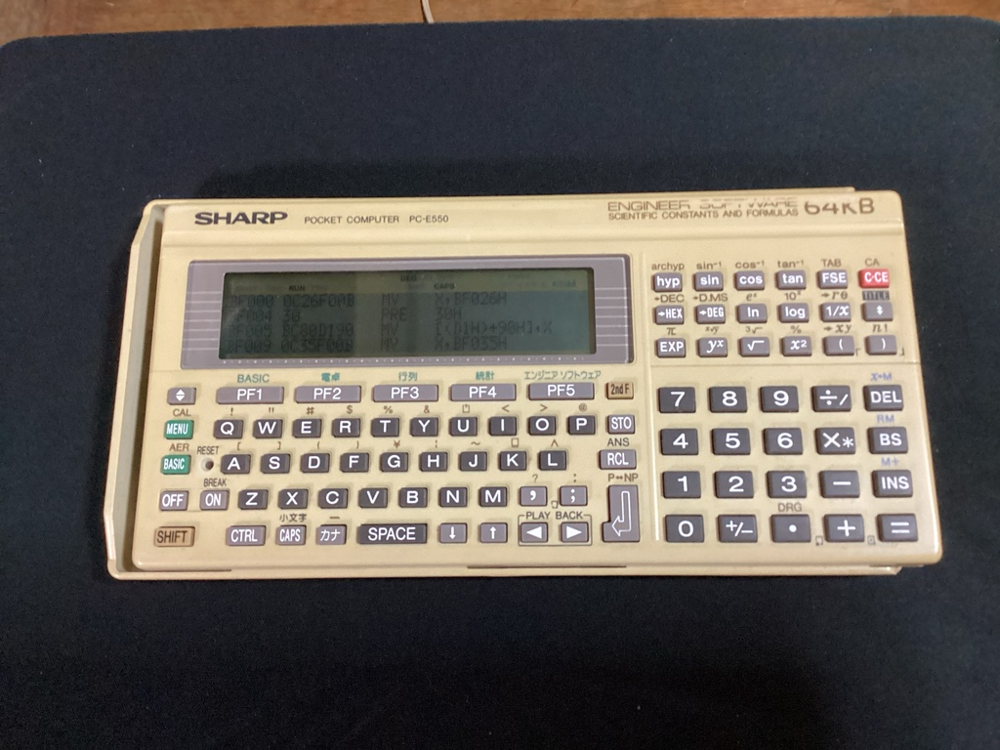

# SC62015 Opcode Reference

A reference repository for reconstructed **SC62015** opcodes, registers, addressing modes, and instruction notes based on historical printed source material.

The **SC62015** is the CPU used in SHARP pocket computers such as the **PC-E500** series.

This repository is a **conservative reconstruction reference**, **not** an **official vendor document** and **not** a **final authority**.

*PLAY3 reverse engineering on a real SHARP PC-E550, shown here as a practical use case for the SC62015 opcode reference.*

---

## Status

This repository is an active documentation and reconstruction project.

Supporting reference documents are already being organized here, including:

- opcode tables
- register notes
- addressing-mode notes
- prebyte notes
- instruction summaries
- instruction-group documents
- methodology notes

The opcode reference is being finalized conservatively from printed source material.
Where a reading is unclear, it is treated as **unresolved** or **partial** rather than guessed.

---

## Start here

Recommended reading order:

1. `docs/opcodes-00-ff.md`
2. `docs/operands.md`
3. `docs/instructions.md`
4. `docs/methodology.md`

Japanese documents are available under:

- `docs/ja/`
- `README-ja.md`

---

## Repository structure

Current top-level contents include:

- `README.md` — English overview
- `README-ja.md` — Japanese overview
- `docs/` — English technical documents
- `docs/ja/` — Japanese technical documents
- `img/` — repository images used in documentation

The documentation is being arranged so that readers can move from:

1. CPU structure and notation
2. registers and operands
3. addressing and prebytes
4. instruction-group notes
5. final opcode tables

---

## Source policy

This repository follows a strict source policy:

- primary printed source expressions are respected as much as possible
- speculative notation is avoided
- unclear readings are marked as unresolved or partial rather than silently guessed
- stable reconstructed reference files are preferred over unstable scratch material
- documented caution is preferred over false certainty

This is a reconstruction/reference effort based on historical printed material.

---

## Scope

This project aims to preserve and organize practical reference material for:

- opcode tables
- register classes
- addressing modes
- prebyte behavior
- instruction-family summaries
- reconstruction notes and caveats

The repository is intended as a **reference-oriented project**, not as a dump of every intermediate working artifact.

---

## Notes

Because the SC62015 is poorly documented online, even partial reconstruction work can be useful.
At the same time, this project does not treat uncertain readings as final facts.

Real-hardware verification is **not yet complete for all items**.
Please treat this repository as a carefully reconstructed practical reference.

---

## License

Unless otherwise stated, original historical source materials are **not** redistributed here as free-content material.

The repository license applies to newly written reference texts, explanatory notes, and reconstructed documentation included in this repository.

---

## Japanese version

For the Japanese overview, see:

- `README-ja.md`
